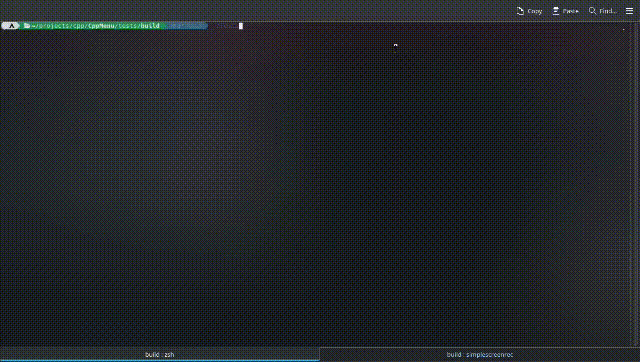

# CppMenu

> [!NOTE]
> TL;DR: Portable and easy-to-use ```C++``` library which provides a safe CLI Menu for user-defined functions.

Have you ever built a simple ```C++``` CLI program and end up needing to write dedicated functions to create a menu system for it? Well, what about focusing on developing your solution and leaving all that boring task to a library 😉 That's what this is for! On top of that, wouldn't you like all your CLI projects to have a consistent look? 👀 

### Tests running


## How to implement in your own projects, using ```CMake```

> [!IMPORTANT]
> This library automatically fetches the , since it's required to work. Thus, you don't have to directly include it.

> [!TIP]
> The simplest way to implement this library in your projects would be by fetching the library as a subdirectory of a given project's ```CMake``` script, and ultimately, make use of ```include_directory()``` to execute this directory's ```CMakeLists.txt```, which makes it possible to use ```target_link_libraries()``` with your executable and the ```CPP_SAFE_IO``` variable, as follows:

Your project's directory structure:
```
./project
    CMakeLists.txt
    src/
    CppMenu/
```

Your project's main ```CMakeLists.txt```:
```
...

add_subdirectory(CppMenu)
target_link_libraries(YourExecutable ${CPP_MENU})

...
```

> [!NOTE]
> This approach is used by this project's ```tests``` directory.

Nonetheless, I highly recommend making use of a second, cleaner approach where you don't have to directly include the library as one of your project's subdirectories:

> [!IMPORTANT]
> For this approach, your ```CMake``` script should use at least ```CMake 3.14```.

You can just fetch it using ```FetchContent```, and then link the library as follows:

Your project's main ```CMakeLists.txt```:
```
...

include(FetchContent)

FetchContent_Declare( cppmenu
    GIT_REPOSITORY  https://github.com/DanielRamirez404/CppMenu.git
    GIT_TAG         v1.0.0
    GIT_SHALLOW     TRUE 
) 

FetchContent_MakeAvailable(cppmenu)

target_link_libraries(YourExecutable ${CPP_MENU})

...
```

> [!NOTE]
> You can optionally change the value of the ```CPP_MENU``` variable before the  ```FetchContent_MakeAvailable()``` call, if you wish so, since it won't be overwritten and it'll show up when building the project.

## How to use

You only need to include the ```cppmenu.h``` header file. Henceforth, all of the library's functions and classes will be available inside of the ```CppMenu``` namespace, similarly to the ```std``` namespace of the ```C++ Standard Library```. To use a menu, you just initialize a ```Cpp::Menu::CommonMenu``` or ```Cpp::Menu::DisplayOnceMenu``` object and use the ```run()``` method. Here's a simple example showcasing a program that uses a ```Cpp::Menu::CommonMenu``` object: 

> [!TIP]
> You can also add the ```using namespace CppMenu;``` statement if you wish to use this library's functions and classes without needing to write the namespace, although that's usually considered a bad practice.

> [!TIP]
> Additionally, since this library automatically includes the , you can also include the ```cppsafeio.h``` header file if you wish to use it.

main.cpp:
```
#include "cppmenu.h"

void printHelloWorld()
{
    CppMenu::print("Hello World!");
}

int main()
{
    CppMenu::CommonMenu menu
    {
        "SAMPLE MENU",

        {
            { "Print Hello World", &printHelloWorld }
        },

        true
    };

    menu.run();
    return 0;
}
```

## Supported Features

> [!WARNING]
> Don't forget to add the ```CppSafeIO``` namespace if you want to try out any of these features.

### Supported Functions

* ```void setMaxWidth(std::size_t width)```: sets the maximum width of all printing functions of the library.
* ```void print(const std::string& string)```: prints the string to the console followed by a line break. If its size is greater than the maximum width, it prints a line break and keeps printing the remaining text.
* ```void printBreak()```: prints a series of ```-``` characters on the same line as a delimiter followed by a line break.
* ```void centerPrint(const std::string& string)```: prints the string followed by a line break, while making sure that it's centered on the maximum width. if its size is greater than the maximum width, it prints a line break and keeps printing the remaining text.
* ```void pressEnterToContinue()```: it shows a default "Press Enter to continue" message and waits for the user to input the enter key.

### Supported Classes

* ```CommonMenu(const std::string& title, const Items& items, bool isMainMenu = false)```: menu that will be displayed again after you select any option.
* ```DisplayOnceMenu(const std::string& title, const Items& items, bool isMainMenu = false)```: menu that won't be displayed again after you select any option.

Both classes use the **same constructor** (it comes from a base class), which gets the title, the menu items and an optional boolean that changes the exit option's statement between "Exit" (if it's considered a mainMenu) and "Go Back" (if it isn't).

The ```CppMenu::Menu::Items``` datatype is actually an alias for ```std::vector<CppMenu::Menu::Item>```, that is a "list" (dynamic array, in fact) of the ```CppMenu::Menu::Item``` struct that consists in the following data, respectively: 

```
struct CppMenu::Menu::Item
{
    std::string name{};                 // identifies the function on the menu
    std::function<void()> function{};   // stores the function to call it when it's selected on the menu
    bool haltOnDone{ true };            // if set up, after calling the function, the program's execution will halt and wait for the user to input the enter key
}
```

> [!IMPORTANT]
> As you can notice, the valid functions that you can use with the ```function``` member variable must be non-returning, and have no arguments.

> [!TIP]
> If you need to use a function with arguments, you can just use ```std::bind```, whose documentation you can read .

> [!TIP]
> When creating your menu's, instead of directly creating items objects you can use ```initializer lists``` and pass your arguments, like this:
> ```
> CppMenu::DisplayOnceMenu menu
> {
>     "TITLE",
>     {                                                         // this is automatically recognized as the CppMenu::Menu::Items alias
>         { "Function Title", &nonReturningFunction, false }    // this is automatically recognized as the CppMenu::Menu::Item struct 
>     },
> };
> ```

Both menu classes have a public ```run()``` method which you can use to call your previously initialized menu, and enjoy its simplicity!

> [!NOTE]
> If any of your functions throws an exception, it'll be safely caught, logged into the console and then the program's execution will be resumed. You can check this out in the ```tests``` subdirectory.

## Testing

> [!TIP]
> You can test this library's functions in the ```tests``` subdirectory.
